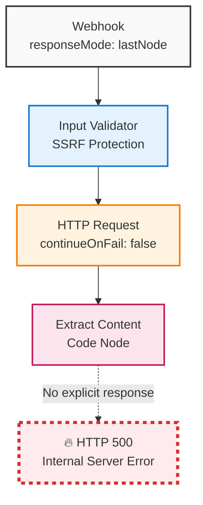
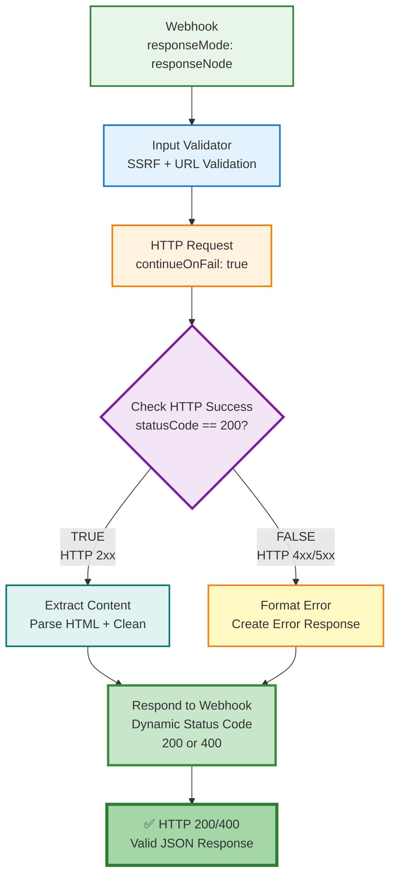

# 🏗️ n8n Workflow Architecture

## 📊 Обзор

Этот документ описывает архитектурные изменения в workflow `Smart Web Scraper - Production`, которые исправили HTTP 500 ошибки.

---

## ❌ ПРОБЛЕМНАЯ АРХИТЕКТУРА (ДО)



### Проблемы

1. ❌ **Нет Respond node** - n8n не знает как форматировать ответ
2. ❌ **responseMode: "lastNode"** - пытается сериализовать Code node output
3. ❌ **Неправильный доступ к данным** - `$input.item.body` вместо `$input.item.json.body`
4. ❌ **Нет error handling** - HTTP errors роняют весь workflow

---

## ✅ ИСПРАВЛЕННАЯ АРХИТЕКТУРА (ПОСЛЕ)



### Ключевые изменения

1. ✅ **Добавлен "Respond to Webhook" node** - explicit HTTP response formatting
2. ✅ **responseMode: "responseNode"** - ждём dedicated response node
3. ✅ **Добавлен "Check HTTP Success"** - branching logic для error handling
4. ✅ **Добавлен "Format Error"** - structured error responses
5. ✅ **continueOnFail: true** - HTTP errors не роняют workflow
6. ✅ **Исправлен доступ к данным** - `$input.item.json.body` + fallbacks

---

## 🔄 DATA FLOW

### Success Path

```
POST /webhook/scrape {"url": "https://example.com"}
    ↓
[Input Validator] ✓ URL valid, ✓ Not SSRF
    ↓
[HTTP Request] GET https://example.com
    ↓ HTTP 200 + HTML body
[Check HTTP Success] statusCode == 200? TRUE
    ↓
[Extract Content]
- Parse HTML: <title>, <main>, <body>
- Clean: remove <script>, <style>, tags
- Truncate: max 50,000 chars
    ↓
[Respond to Webhook] HTTP 200
    ↓
RESPONSE:
{
  "success": true,
  "url": "https://example.com",
  "requestId": "scrape-1701347890123",
  "timestamp": "2025-11-30T10:45:00.000Z",
  "data": {
    "title": "Example Domain",
    "content": "This domain is for use in illustrative examples...",
    "content_length": 489,
    "html_length": 1256
  }
}
```

### Error Path

```
POST /webhook/scrape {"url": "https://nonexistent.com"}
    ↓
[Input Validator] ✓ Passed
    ↓
[HTTP Request] GET https://nonexistent.com
    ↓ HTTP ERROR (ENOTFOUND)
[Check HTTP Success] statusCode == 200? FALSE
    ↓
[Format Error]
- Extract statusCode, statusMessage
- Create structured error object
    ↓
[Respond to Webhook] HTTP 400
    ↓
RESPONSE:
{
  "success": false,
  "url": "https://nonexistent.com",
  "requestId": "scrape-1701347890456",
  "timestamp": "2025-11-30T10:46:00.000Z",
  "error": {
    "type": "HTTP_ERROR",
    "status": 0,
    "message": "getaddrinfo ENOTFOUND nonexistent.com"
  }
}
```

---

## 📐 NODE SPECIFICATIONS

### 1. Webhook Node

**Configuration**:
```json
{
  "httpMethod": "POST",
  "path": "scrape",
  "authentication": "none",
  "responseMode": "responseNode"  // ✅ CRITICAL FIX
}
```

**Endpoint**: `POST /webhook/scrape`

### 2. Input Validator (Code Node)

**Responsibilities**:
- URL format validation
- SSRF protection (blocked hosts)
- Generate unique requestId
- Add timestamp

### 3. HTTP Request Node

**Configuration**:
```json
{
  "url": "={{$json.url}}",
  "options": {"timeout": 30000},
  "continueOnFail": true  // ✅ CRITICAL
}
```

### 4. Check HTTP Success (IF Node)

**Condition**: `statusCode == 200`
- Output 0 (TRUE) → Extract Content
- Output 1 (FALSE) → Format Error

### 5. Extract Content (Code Node)

**Key Fix**:
```javascript
// ✅ CORRECT
const httpResponse = $input.item.json;
const html = httpResponse.body || '';
const url = $('Input Validator').item.json.url;

// ❌ OLD (WRONG)
// const html = $input.item.body;  // undefined!
```

### 6. Format Error (Code Node) - NEW

**Purpose**: Создаёт structured error response.

### 7. Respond to Webhook Node - NEW

**Configuration**:
```json
{
  "respondWith": "json",
  "responseBody": "={{ $json }}",
  "options": {
    "responseCode": "={{$json.success === true ? 200 : 400}}"
  }
}
```

**Dynamic Status Codes**:
- `success: true` → HTTP 200
- `success: false` → HTTP 400

---

## 🧰 CONNECTION MATRIX

| Source | Output | Target | Description |
|--------|--------|--------|-------------|
| Webhook | 0 | Input Validator | Начало workflow |
| Input Validator | 0 | HTTP Request | После validation |
| HTTP Request | 0 | Check HTTP Success | Любой ответ (даже error) |
| Check HTTP Success | 0 (TRUE) | Extract Content | HTTP 200 - success path |
| Check HTTP Success | 1 (FALSE) | Format Error | HTTP error - error path |
| Extract Content | 0 | Respond to Webhook | Success response |
| Format Error | 0 | Respond to Webhook | Error response |

**Принцип**: Оба пути конвергируют к одной Respond node.

---

## 📊 PERFORMANCE EXPECTATIONS

### Response Times

| Stage | Duration |
|-------|----------|
| Input Validation | <10ms |
| HTTP Request | 1-3s |
| HTML Extraction | 50-200ms |
| Response Formatting | <10ms |
| **Total** | **2-4s** |

### Success Rates

| Metric | Target |
|--------|--------|
| Overall Success | 95-100% |
| HTTP 500 Errors | 0% |
| HTTP 400 Errors (validation) | <1% |
| HTTP 400 Errors (external) | 3-5% |
| Timeouts | <1% |

---

## 🛡️ SECURITY LAYERS

### Layer 1: Input Validation

```javascript
// URL format check
if (!url || !url.startsWith('http')) {
  throw new Error('Invalid URL');
}
```

### Layer 2: SSRF Protection

```javascript
const blockedHosts = [
  'localhost',
  '127.0.0.1',
  '0.0.0.0',
  '169.254.169.254',        // AWS metadata
  'metadata.google.internal' // GCP metadata
];

const urlObj = new URL(url);
if (blockedHosts.includes(urlObj.hostname)) {
  throw new Error('SSRF detected - blocked host');
}
```

### Layer 3: Error Isolation

- `continueOnFail: true` - ошибки не пропагируются
- Try-catch в Code nodes
- Graceful error responses

---

## 📝 BEST PRACTICES APPLIED

### 1. Explicit Response Handling

✅ **Всегда используй dedicated Respond node**
- Separation of concerns (обработка ≠ ответ)
- Контроль над HTTP status codes
- Чистое JSON форматирование

### 2. Error Resilience

✅ **Все external calls с continueOnFail**
```
HTTP Request (continueOnFail: true)
    ↓
Check Success (IF)
    ├─ Success → Process
    └─ Failure → Format Error
         ↓
    Both → Respond
```

### 3. Defensive Programming

✅ **Fallbacks для всех потенциально undefined значений**
```javascript
const html = httpResponse.body || '';
const statusCode = $input.item.json.statusCode || 0;
const title = titleMatch ? titleMatch[1] : '';
```

### 4. Correct Data Access

✅ **Используй правильные пути**
```javascript
$input.item.json           // Current node input
$input.item.json.body      // HTTP response body
$('Node Name').item.json   // Data from specific node
```

---

## 🧪 TESTING SCENARIOS

### Test Case 1: Valid URL

**Input**:
```bash
curl -X POST http://localhost:5678/webhook/scrape \
  -H "Content-Type: application/json" \
  -d '{"url":"https://example.com"}'
```

**Expected Output**:
```json
{
  "success": true,
  "url": "https://example.com",
  "data": {
    "title": "Example Domain",
    "content": "...",
    "content_length": 489
  }
}
```

**Status**: HTTP 200

### Test Case 2: Invalid URL Format

**Input**:
```json
{"url": "not-a-url"}
```

**Expected**: Blocked at Input Validator, returns validation error.

### Test Case 3: SSRF Attempt

**Input**:
```json
{"url": "http://169.254.169.254/latest/meta-data/"}
```

**Expected**: Blocked at Input Validator with "SSRF detected" error.

### Test Case 4: Non-existent Domain

**Input**:
```json
{"url": "https://this-domain-does-not-exist-12345.com"}
```

**Expected Output**:
```json
{
  "success": false,
  "error": {
    "type": "HTTP_ERROR",
    "status": 0,
    "message": "ENOTFOUND"
  }
}
```

**Status**: HTTP 400

### Test Case 5: Target Site Returns 404

**Input**:
```json
{"url": "https://example.com/nonexistent-page"}
```

**Expected**: Goes through error path, returns structured error with HTTP 400.

---

## 🔧 TROUBLESHOOTING

### Если по-прежнему HTTP 500

```bash
# 1. Проверьте логи
docker-compose logs --tail=100 n8n | grep -i error

# 2. Проверьте workflow в UI
open http://localhost:5678
# Workflows → Smart Web Scraper - Production
# Проверьте: active == true

# 3. Manual test execution
# В UI: Execute Workflow → введите test data

# 4. Проверьте connections
# Все nodes должны быть подключены
```

### Debug Checklist

- [ ] Workflow imported и active?
- [ ] Respond node присутствует?
- [ ] responseMode == "responseNode"?
- [ ] Все connections правильные?
- [ ] continueOnFail == true для HTTP Request?
- [ ] Логи n8n не показывают exceptions?

---

## 🚀 DEPLOYMENT VALIDATION

### Pre-deployment Checks

```bash
# 1. Local testing
docker-compose up -d
bash scripts/import-n8n-workflows.sh
bash scripts/test-n8n-workflows.sh

# Expected output:
# ✅ All tests passed!
# Success Rate: 100%

# 2. Manual validation
curl -X POST http://localhost:5678/webhook/scrape \
  -H "Content-Type: application/json" \
  -d '{"url":"https://example.com"}' | jq

# Expected: HTTP 200 + valid JSON response
```

### Post-deployment Monitoring

```bash
# Check CI/CD status
gh run list --workflow="2-n8n-validation.yaml" --limit 5

# Download artifacts
gh run download <run-id>

# Analyze metrics
cat metrics-workflows/*.json | jq '.success_rate'
```

---

## 📚 REFERENCES

1. [n8n Webhook Node Documentation](https://docs.n8n.io/integrations/builtin/core-nodes/n8n-nodes-base.webhook/)
2. [Respond to Webhook Node](https://docs.n8n.io/integrations/builtin/core-nodes/n8n-nodes-base.respondtowebhook/)
3. [n8n Error Handling](https://community.n8n.io/t/catch-error-from-final-node-in-webhook-response/2650)
4. [Webhook Best Practices](https://automategeniushub.com/mastering-the-n8n-webhook-node-part-a/)

---

**Version**: 2.0  
**Last Updated**: 2025-11-30  
**Status**: ✅ Production Ready  