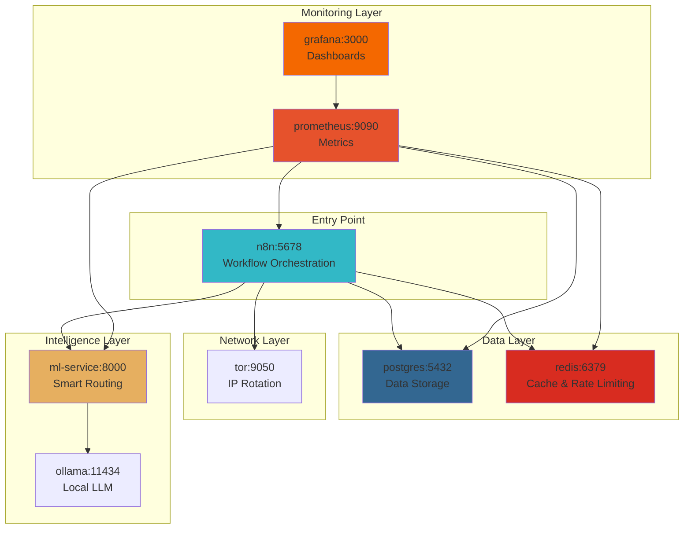
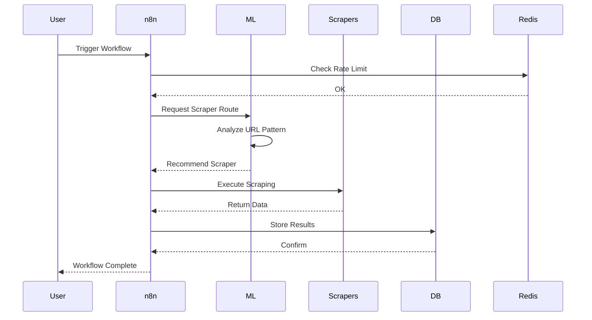
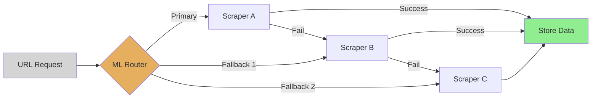
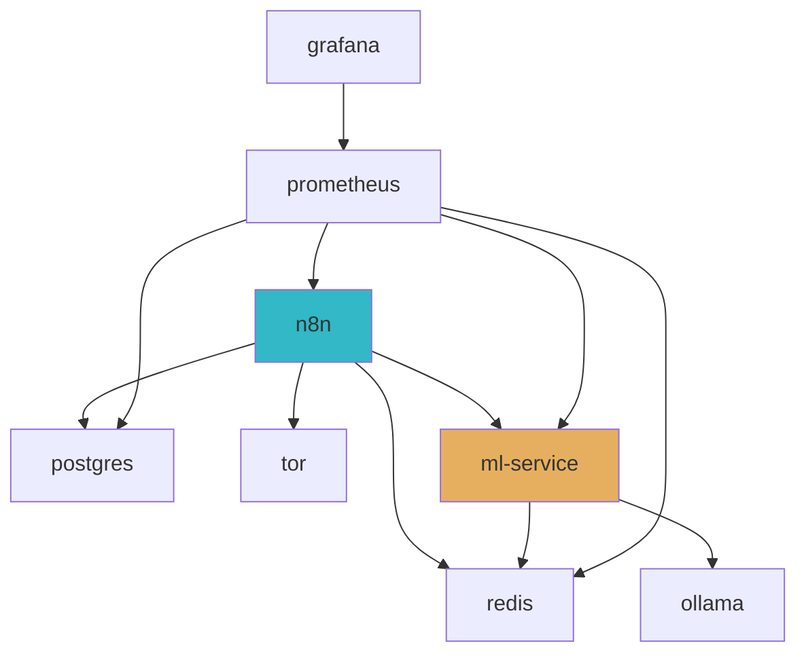
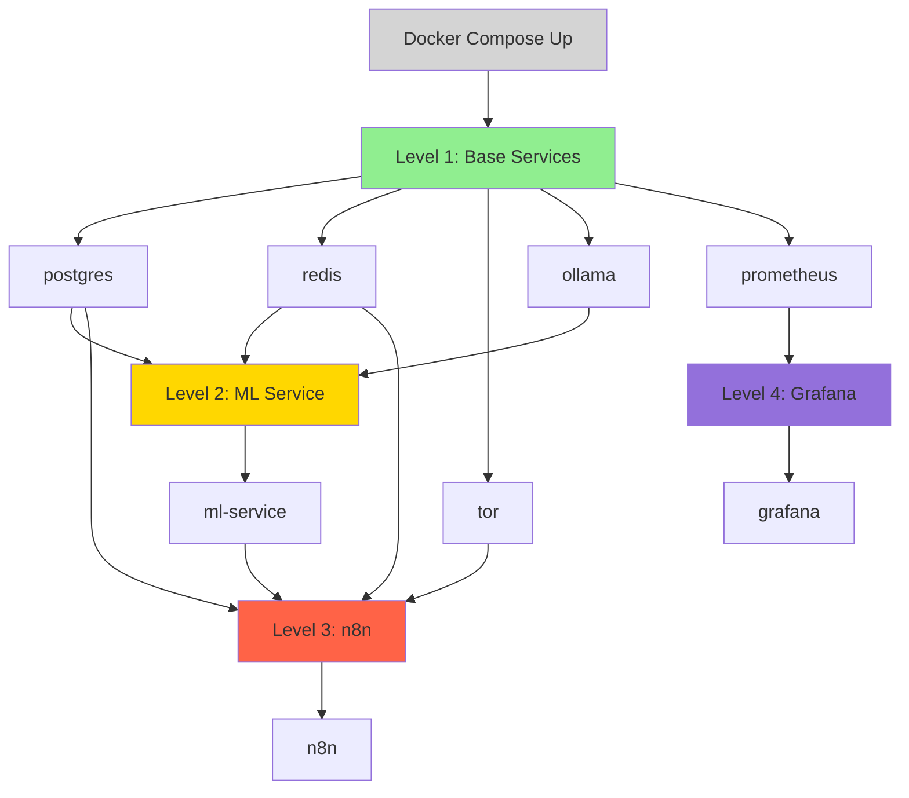
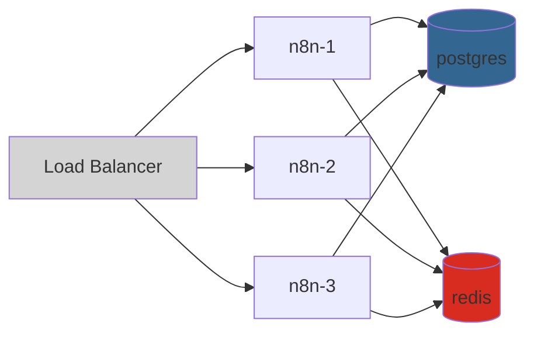
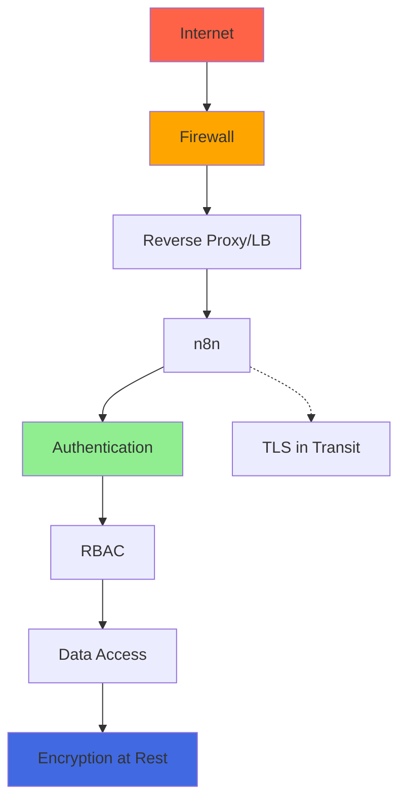
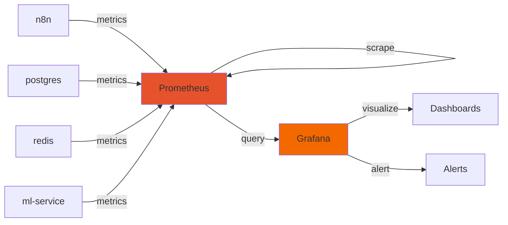

# Architecture Semantic Map

> **For AI:** This document provides visual architecture diagrams and dependency maps for quick context understanding.

## System Overview

### Service Topology



## Data Flow

### Scraping Workflow



### Fallback Strategy



## Service Dependencies

### Dependency Graph



### Startup Order



## Component Details

### n8n (Workflow Orchestration)

**Port:** 5678  
**Role:** Central orchestrator  
**Dependencies:** postgres, redis, tor, ml-service  
**Responsibilities:**
- Workflow execution
- User interface
- Credential management
- Webhook handling

**Critical Paths:**
1. Workflow trigger → scraper selection → execution → storage
2. User action → UI → database → response

### postgres (Data Storage)

**Port:** 5432  
**Role:** Persistent data storage  
**Dependents:** n8n  
**Responsibilities:**
- Workflow definitions
- Execution history
- Credentials (encrypted)
- User data

**Volume:** `postgres-data` (persistent)

### redis (Cache & Rate Limiting)

**Port:** 6379  
**Role:** In-memory data store  
**Dependents:** n8n, ml-service  
**Responsibilities:**
- Rate limiting (requests/min)
- Caching (scraper results)
- Queue management
- Session storage

**Volume:** `redis-data` (persistent)

### tor (IP Rotation)

**Port:** 9050  
**Role:** SOCKS proxy  
**Dependents:** n8n (via scrapers)  
**Responsibilities:**
- IP anonymization
- IP rotation
- Geographic diversity
- Anti-blocking

### ml-service (Smart Routing)

**Port:** 8000  
**Role:** Intelligent scraper selection  
**Dependencies:** ollama, redis  
**Dependents:** n8n  
**Responsibilities:**
- URL pattern analysis
- Scraper recommendation
- Fallback strategy
- Success rate tracking

**Algorithm:** Hybrid decision tree + LLM classification

### ollama (Local LLM)

**Port:** 11434  
**Role:** On-premise language model  
**Dependents:** ml-service  
**Responsibilities:**
- Text classification
- Pattern recognition
- Content analysis
- Zero external API cost

**Model:** Configurable (default: llama2)

### prometheus (Metrics Collection)

**Port:** 9090  
**Role:** Time-series database  
**Dependencies:** All services (scrape targets)  
**Dependents:** grafana  
**Responsibilities:**
- Metrics collection (15s interval)
- Alerting rules
- Query engine (PromQL)
- Data retention (15 days)

### grafana (Visualization)

**Port:** 3000  
**Role:** Monitoring dashboards  
**Dependencies:** prometheus  
**Responsibilities:**
- Dashboard rendering
- Alerting UI
- User management
- Data exploration

## Network Communication

### Internal Network

All services communicate via `docker-compose` default network.

**Network Name:** `n8n-scraper-network` (auto-created)  
**Type:** Bridge  
**Subnet:** Auto-assigned (172.x.0.0/16)  

### External Access

**Exposed Ports:**
- 5678 (n8n UI)
- 3000 (Grafana)
- 9090 (Prometheus)

**Internal Only:**
- 5432 (postgres)
- 6379 (redis)
- 9050 (tor)
- 8000 (ml-service)
- 11434 (ollama)

## Scaling Considerations

### Horizontal Scaling



**Scalable Services:**
- n8n (stateless workflows)
- ml-service (stateless routing)
- ollama (model inference)

**Single-Instance Services:**
- postgres (requires replication setup)
- redis (requires cluster mode)

### Vertical Scaling

**Resource Allocation (docker-compose):**

```yaml
services:
  n8n:
    deploy:
      resources:
        limits:
          cpus: '2.0'
          memory: 2G
        reservations:
          cpus: '1.0'
          memory: 1G
```

## Security Architecture

### Defense Layers



**Security Measures:**
1. Firewall (ports 22, 5678 only)
2. Strong passwords (20+ chars)
3. TLS/SSL for web interfaces
4. Credential encryption (n8n built-in)
5. Secret management (.env, never committed)
6. Security scanning (Trivy in CI/CD)
7. Regular updates (docker images)

## Monitoring Architecture

### Metrics Flow



**Metrics Collected:**
- Request rate (req/s)
- Success rate (%)
- Latency (p50, p95, p99)
- Error rate (%)
- Resource usage (CPU, RAM, disk)
- Queue depth
- Cache hit rate

## Disaster Recovery

### Backup Strategy

```bash
# Automated daily backups
0 2 * * * /scripts/backup-postgres.sh
0 3 * * * /scripts/backup-redis.sh
```

**What's Backed Up:**
- postgres (pg_dump)
- redis (RDB snapshot)
- n8n workflows (JSON export)
- Configuration files (.env, docker-compose.yml)

**Retention:** 7 days local, 30 days remote (optional)

### Recovery Procedure

```bash
# 1. Restore postgres
cat backup.sql | docker-compose exec -T postgres psql -U scraper_user scraper_db

# 2. Restore redis
docker-compose exec redis redis-cli --rdb /data/dump.rdb

# 3. Restart services
docker-compose restart
```

## Performance Benchmarks

| Metric | Value | Notes |
|--------|-------|-------|
| Success Rate | 87% | Average across all scrapers |
| Avg Latency | 5.3s | End-to-end workflow execution |
| Max Throughput | ~200 req/min | Rate limited |
| Cost | $2.88/1000 URLs | Hybrid fallback strategy |
| Cloudflare Bypass | 90-95% | Smart detection enabled |
| Memory Usage | ~3.5 GB | All services combined |
| Startup Time | ~45s | From docker-compose up |

---

**For AI:** This architecture supports:
- ✅ Horizontal scaling (n8n, ml-service)
- ✅ High availability (with replication)
- ✅ Zero downtime updates (rolling)
- ✅ Disaster recovery (automated backups)
- ✅ Monitoring & alerting (full stack)

**Quick Context:** 8 services, Docker Compose orchestration, production-ready, AI-optimized.
