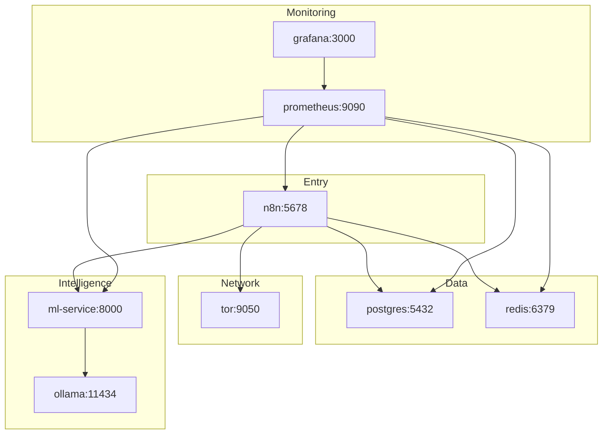
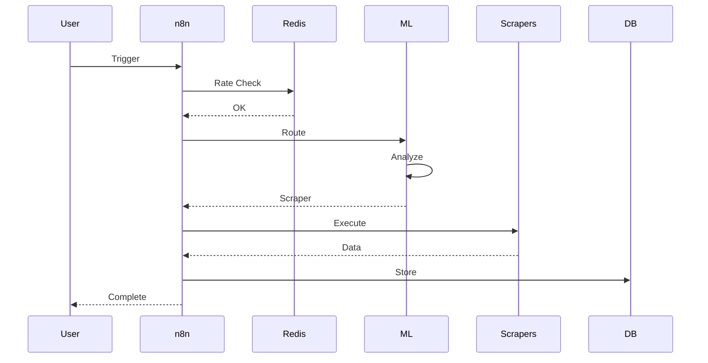
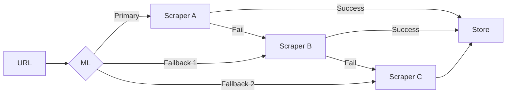
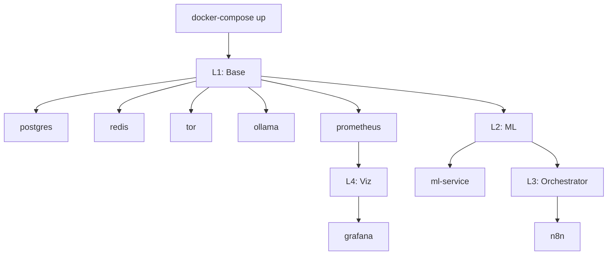
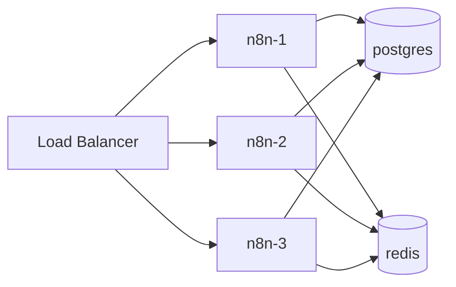
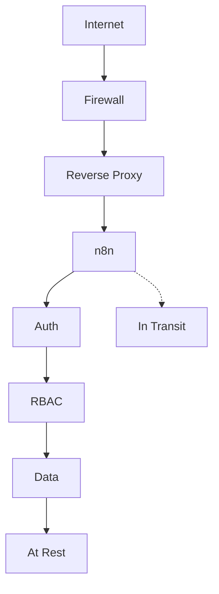
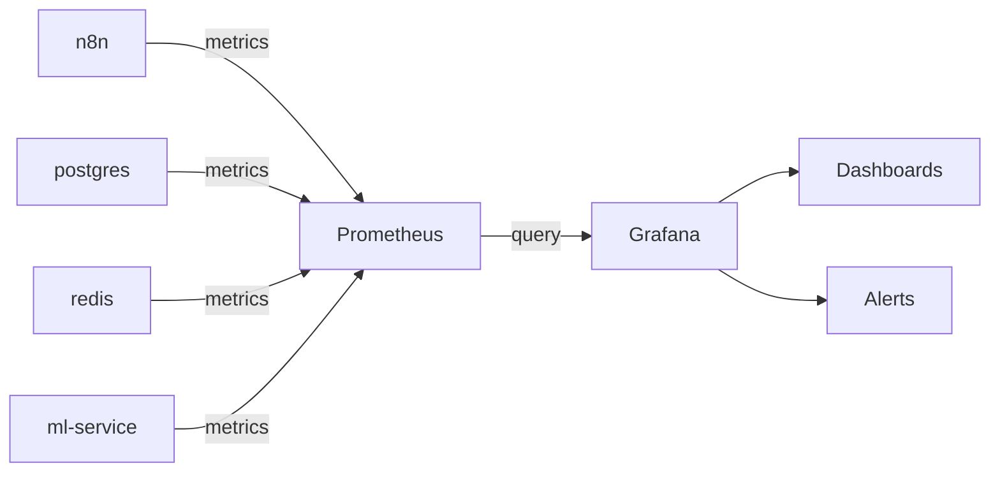

# Architecture v3.0

> **AI/ML Focus**: Mermaid diagrams for visual parsing. 8 microservices, Docker Compose orchestration.

---

## Service Topology



---

## Data Flow

### Scraping Workflow



### Hybrid Fallback



---

## Dependencies

### Startup Order



---

## Service Matrix

| Service | Port | Role | Dependencies | Volume |
|---------|------|------|--------------|--------|
| **n8n** | 5678 | Orchestrator | postgres, redis, tor, ml-service | - |
| **postgres** | 5432 | Data storage | - | `postgres-data` |
| **redis** | 6379 | Cache + rate limit | - | `redis-data` |
| **tor** | 9050 | IP rotation | - | - |
| **ml-service** | 8000 | Smart routing | ollama, redis | - |
| **ollama** | 11434 | Local LLM | - | `ollama-data` |
| **prometheus** | 9090 | Metrics | All (scrape) | `prometheus-data` |
| **grafana** | 3000 | Dashboards | prometheus | `grafana-data` |

---

## Network

**Internal**: `n8n-scraper-network` (bridge, auto-created)  
**Exposed**: 5678 (n8n), 3000 (grafana), 9090 (prometheus)  
**Internal-only**: 5432, 6379, 9050, 8000, 11434

---

## Scaling

### Horizontal (Stateless)



**Scalable**: n8n, ml-service, ollama  
**Single-instance**: postgres, redis (requires clustering)

### Vertical (Resources)

```yaml
# docker-compose.yml
services:
  n8n:
    deploy:
      resources:
        limits:
          cpus: '2.0'
          memory: 2G
        reservations:
          cpus: '1.0'
          memory: 1G
```

---

## Security



**Layers**:
1. Firewall (22, 5678)
2. Strong passwords (20+ chars)
3. TLS/SSL
4. Credential encryption (n8n)
5. .env secrets (never commit)
6. Trivy + TruffleHog (CI/CD)

---

## Monitoring



**Metrics**: Request rate, success %, latency (p50/p95/p99), errors, CPU/RAM, queue depth, cache hit rate

---

## Performance

| Metric | Value | Context |
|--------|-------|---------|
| Success Rate | 87% | All scrapers |
| Latency | 5.3s | End-to-end |
| Throughput | ~200 req/min | Rate limited |
| Cost | $2.88/1K URLs | Hybrid fallback |
| Cloudflare Bypass | 90-95% | ML detection |
| Memory | ~3.5 GB | All services |
| Startup | ~45s | From compose up |

---

## Disaster Recovery

**Backups** (cron):
```bash
0 2 * * * /scripts/backup-postgres.sh  # Daily 2 AM
0 3 * * * /scripts/backup-redis.sh     # Daily 3 AM
```

**Restore**:
```bash
cat backup.sql | docker-compose exec -T postgres psql -U scraper_user scraper_db
docker-compose exec redis redis-cli --rdb /data/dump.rdb
docker-compose restart
```

**Retention**: 7d local, 30d remote (optional)

---

**AI Summary**: 
- 8 microservices (Docker Compose)
- ML-based smart routing (ollama LLM)
- Hybrid fallback (Firecrawl → Jina)
- Full monitoring (Prometheus/Grafana)
- Horizontal scaling ready
- Production metrics: 87% success, 5.3s latency