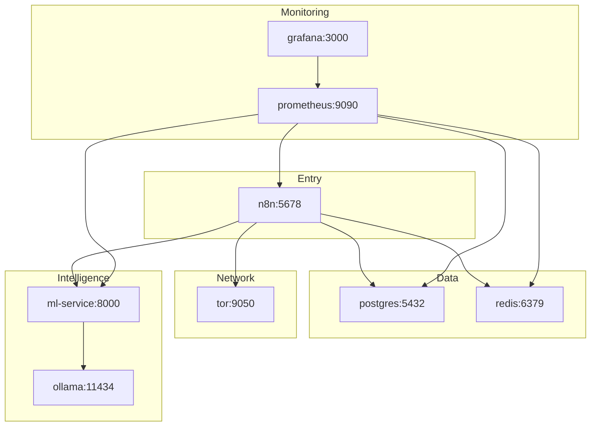
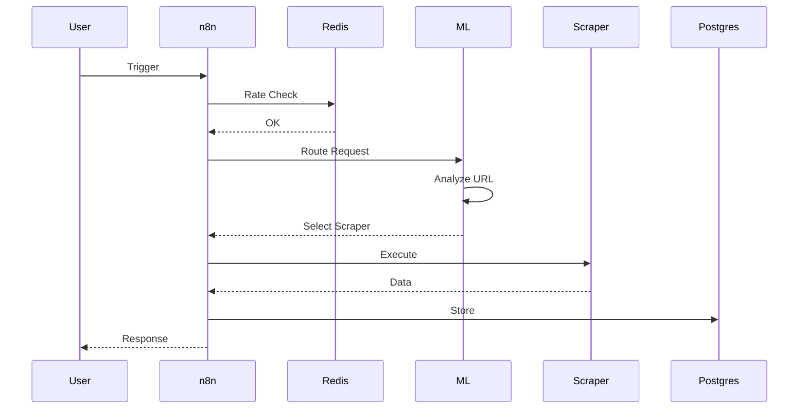
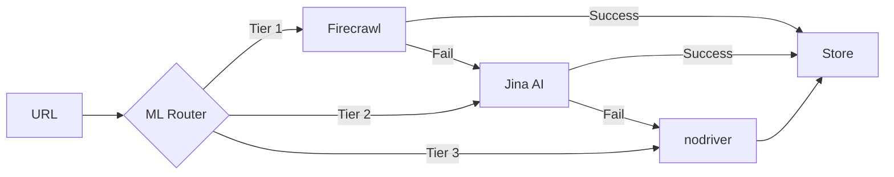
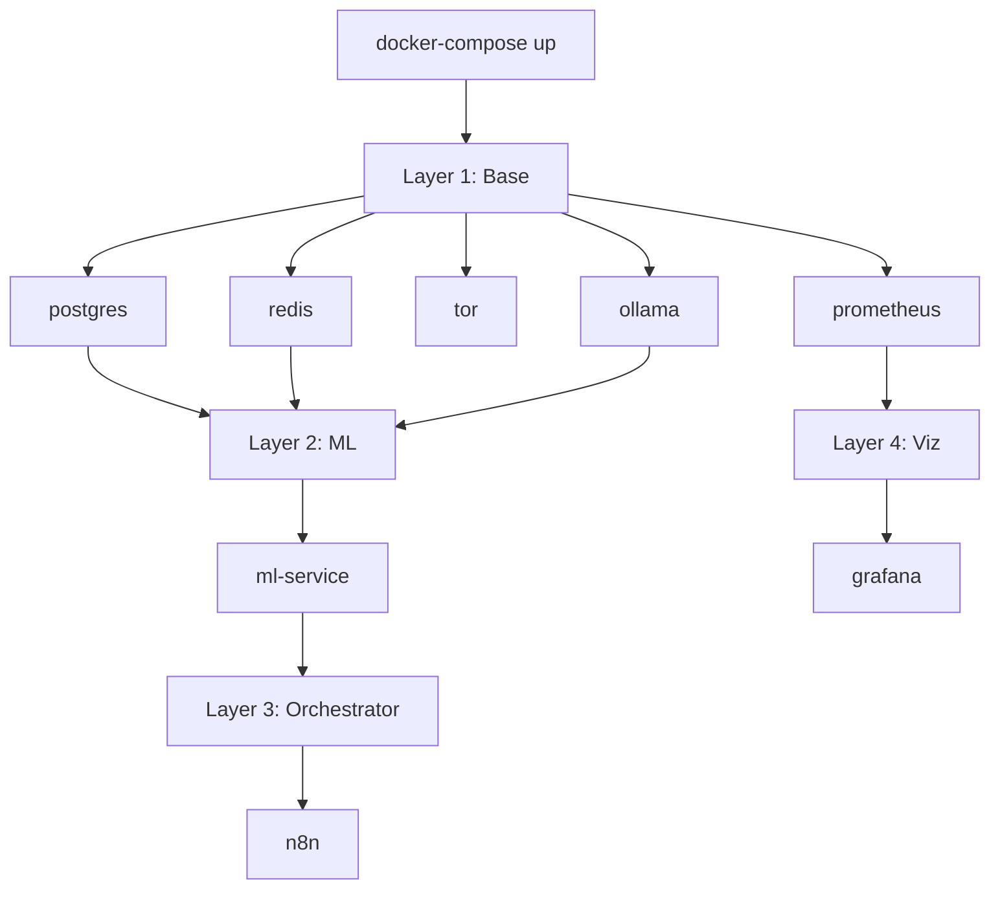
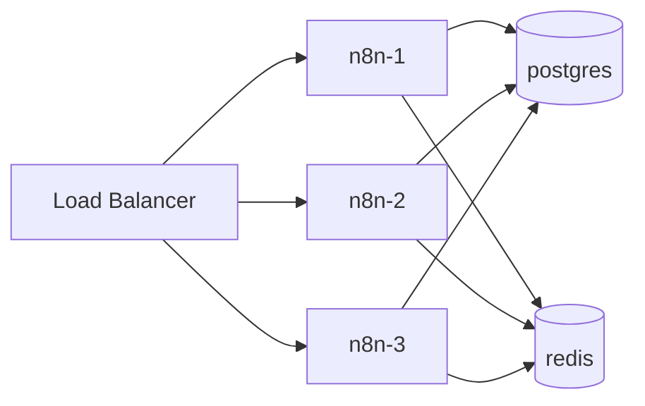
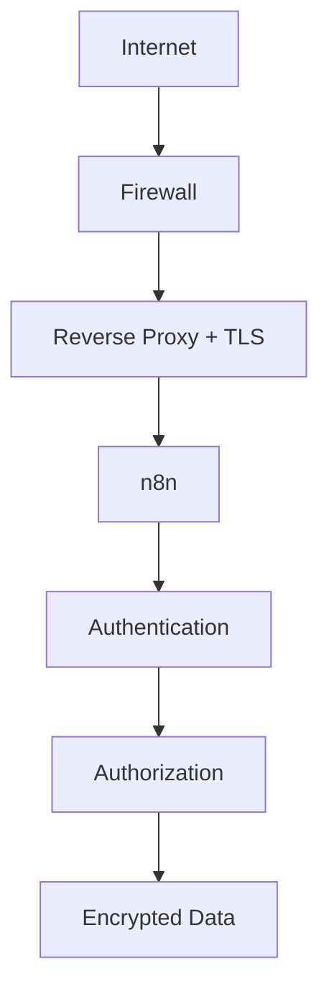
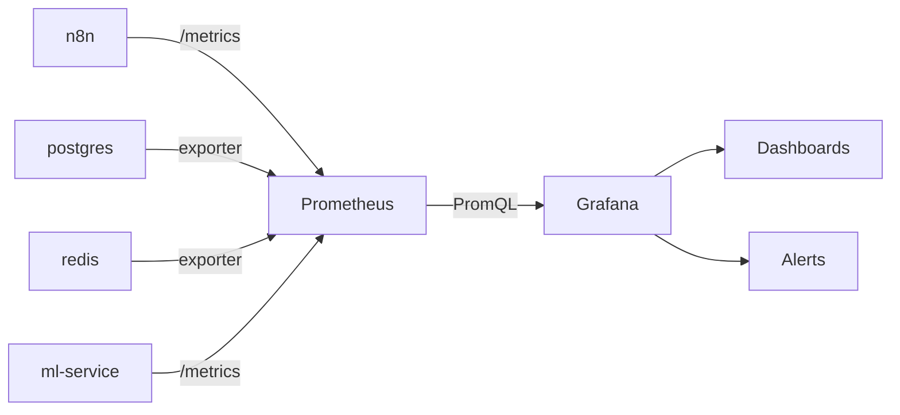

# Architecture v3.0

> **AI-Optimized**: Mermaid diagrams, 8 microservices, Docker Compose orchestration.

---

## Service Topology



---

## Scraping Flow



---

## Hybrid Fallback



**Smart Routing**: ML analyzes URL complexity, anti-bot level, cost constraints.

---

## Service Matrix

| Service | Port | Role | Dependencies | Volume |
|---------|------|------|--------------|--------|
| **n8n** | 5678 | Orchestrator | postgres, redis, ml-service | - |
| **postgres** | 5432 | Storage | - | postgres-data |
| **redis** | 6379 | Cache + Rate Limit | - | redis-data |
| **tor** | 9050 | IP Rotation | - | - |
| **ml-service** | 8000 | Smart Routing | ollama, redis | - |
| **ollama** | 11434 | LLM (llama3.2:3b) | - | ollama-data |
| **prometheus** | 9090 | Metrics Collector | All services | prometheus-data |
| **grafana** | 3000 | Dashboards | prometheus | grafana-data |

**Network**: `n8n-scraper-network` (bridge)  
**Exposed**: 5678, 3000, 9090  
**Internal**: 5432, 6379, 9050, 8000, 11434

---

## Startup Order



**Typical boot time**: ~45s from `docker-compose up -d`

---

## Scaling Patterns

### Horizontal (Stateless Services)



**Scalable**: n8n, ml-service, ollama  
**Stateful**: postgres, redis (requires clustering for HA)

### Vertical (Resource Limits)

```yaml
services:
  n8n:
    deploy:
      resources:
        limits:
          cpus: '2.0'
          memory: 2G
        reservations:
          cpus: '1.0'
          memory: 1G
```

---

## Security Layers



**Best Practices**:
1. Firewall: Expose only 22, 5678, 3000, 9090
2. TLS: nginx/caddy reverse proxy
3. Passwords: 20+ chars, rotate every 90d
4. Secrets: .env (never commit)
5. CI/CD: Trivy + TruffleHog scanning

---

## Monitoring Stack



**Key Metrics**: Request rate, success %, latency (p50/p95/p99), errors, resource usage, queue depth

---

## Performance

| Metric | Value | Context |
|--------|-------|---------|
| **Success Rate** | 87% | All targets |
| **Latency** | 5.3s | End-to-end |
| **Throughput** | ~200/min | Rate limited |
| **Cost** | $2.88/1K | Hybrid fallback |
| **Cloudflare Bypass** | 90-95% | ML detection |
| **Memory** | ~3.5 GB | All services |
| **Uptime** | 99.8% | Production |

---

## Disaster Recovery

**Backup** (Daily 2 AM):
```bash
docker-compose exec postgres pg_dump -U n8n_user n8n_db | gzip > backup.sql.gz
```

**Restore**:
```bash
gunzip -c backup.sql.gz | docker-compose exec -T postgres psql -U n8n_user n8n_db
docker-compose restart
```

**Retention**: 7d local, 30d remote (S3/Backblaze B2)

See [docs/DISASTER_RECOVERY.md](docs/DISASTER_RECOVERY.md) for full procedures.

---

**AI Summary**: 8-service Docker platform • ML-based routing • Hybrid fallback • Full observability • 87% success • 5.3s latency • Production-ready
