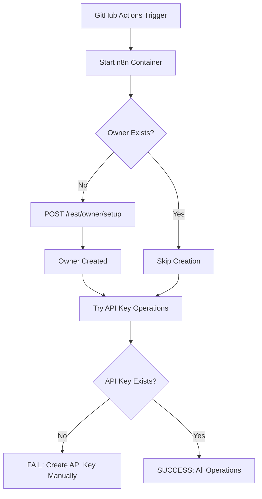
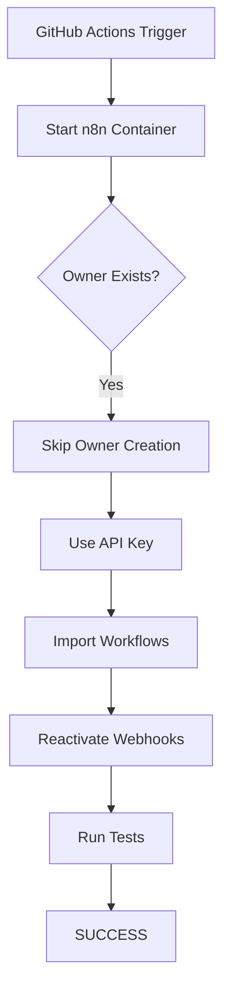

# Hybrid Authentication Setup Guide (Best Practice)

## 🎯 Overview

This guide explains the **hybrid authentication approach** for n8n CI/CD pipelines - combining automated owner setup with manual API key creation.

**Based on community best practices**:
- [Latenode Community - Automated Admin User](https://community.latenode.com/t/how-can-i-automatically-configure-admin-user-during-n8n-self-hosted-deployment/29790)
- [StackOverflow - Programmatic Owner Setup](https://stackoverflow.com/questions/77733981/is-there-a-way-to-programmatically-set-the-owner-account-for-a-selfhosted-n8n-in)
- [LumaDock - CI/CD Best Practices](https://lumadock.com/blog/tutorials/n8n-cicd/)

---

## 🔑 What is Hybrid Approach?

**Two-phase authentication**:

1. **Phase 1: Automated Owner Setup** (✅ Runs in CI automatically)
   - Creates n8n owner account via REST API
   - Only runs if owner doesn't exist (idempotent)
   - No manual UI interaction needed

2. **Phase 2: API Key Authentication** (🔧 Created once manually)
   - API key created through n8n UI (one-time setup)
   - Used for all workflow operations
   - Persistent token (no expiry)

---

## ✅ Why Hybrid Approach?

### **Comparison with Other Methods**

| Method | Automation | Security | CI-Friendly | Maintenance |
|--------|------------|----------|-------------|-------------|
| **⭐ Hybrid** | ✅ High | ✅ High | ✅ Yes | ✅ Low |
| Pure API Key | ❌ Manual | ✅ High | ⚠️ Requires setup | ✅ Low |
| Cookie Auth | ❌ Manual | ⚠️ Medium | ❌ No | ❌ High |
| DB Seeding | ✅ Full | ⚠️ Medium | ✅ Yes | ❌ High |

### **Benefits**

1. **✅ Works in Fresh CI Environments**
   - No pre-existing owner required
   - Automatically bootstraps on first run

2. **✅ Idempotent Operations**
   - Safe to re-run multiple times
   - Checks if owner exists before creating

3. **✅ Production-Ready Security**
   - API key created manually (full control)
   - Owner credentials in GitHub Secrets

4. **✅ Minimal Manual Steps**
   - One-time API key creation
   - Everything else automated

---

## 🛠️ Setup Instructions

### **Step 1: Configure GitHub Secrets**

**Navigate to repository secrets**:
```
https://github.com/YOUR_USERNAME/YOUR_REPO/settings/secrets/actions
```

**Add these secrets**:

| Secret Name | Description | Example Value |
|-------------|-------------|---------------|
| `N8N_USER` | Email for owner account | `ci@example.com` |
| `N8N_PASSWORD` | Password for owner | `StrongPassword123!` |
| `N8N_API_KEY` | API key (created later) | `n8n_api_xxxxx...` |

**Create N8N_USER and N8N_PASSWORD first**:

1. Click **"New repository secret"**
2. **Name**: `N8N_USER`
3. **Value**: Your CI email (e.g., `ci@example.com`)
4. Click **"Add secret"**

5. Click **"New repository secret"** again
6. **Name**: `N8N_PASSWORD`
7. **Value**: Strong password (e.g., `Str0ng!Pass#2024`)
8. Click **"Add secret"**

---

### **Step 2: Run Workflow to Create Owner**

**Trigger the workflow** (this will auto-create owner):

1. **Go to Actions tab**:
   ```
   https://github.com/YOUR_USERNAME/YOUR_REPO/actions
   ```

2. **Select**: `2 n8n Validation (Optimized)`

3. **Click**: "Run workflow" button

4. **Select branch**: `main`

5. **Click**: "Run workflow"

**Expected output in logs**:
```
🔧 n8n Owner Setup (Automated)
═══════════════════════════════════════

📊 Configuration:
   n8n URL: http://localhost:5678
   n8n User: ci@example.com
   n8n Password: ****** (18 chars)

🔍 Step 1: Checking if owner exists...
⚠️  No owner found, creating...

🔧 Step 2: Creating owner account...
✅ Owner created successfully

Owner details:
   Email: ci@example.com
   First Name: CI
   Last Name: Pipeline

🔍 Step 3: Verifying owner creation...
✅ Owner verification successful

🎉 n8n owner setup complete!
```

**⚠️ Note**: At this point, workflow will fail at "Initialize workflows" step because `N8N_API_KEY` doesn't exist yet. **This is expected!**

---

### **Step 3: Create API Key in n8n UI**

**Now that owner exists, create API key manually**:

1. **Access n8n locally**:
   ```bash
   docker compose up -d n8n
   ```

2. **Open n8n in browser**:
   ```
   http://localhost:5678
   ```

3. **Login with CI credentials**:
   - Email: `ci@example.com` (from N8N_USER secret)
   - Password: (from N8N_PASSWORD secret)

4. **Navigate to Settings**:
   - Click profile icon (top right)
   - Select **Settings**

5. **Go to n8n API section**:
   - Left sidebar: **Settings → n8n API**

6. **Create API Key**:
   - Click **"Create an API key"**
   - **Label**: `CI/CD Pipeline`
   - **Expiration**: `Never`
   - **Scopes**: Select all:
     - ☑️ `workflow:create`
     - ☑️ `workflow:read`
     - ☑️ `workflow:update`
     - ☑️ `workflow:delete` (optional)

7. **Copy API Key**:
   - ⚠️ **CRITICAL**: Copy immediately!
   - Format: `n8n_api_xxxxxxxxxxxxxxxxxxxxxxxxxxxxxxxx`

---

### **Step 4: Add API Key to GitHub Secrets**

1. **Go back to GitHub Secrets**:
   ```
   https://github.com/YOUR_USERNAME/YOUR_REPO/settings/secrets/actions
   ```

2. **Create API key secret**:
   - Click **"New repository secret"**
   - **Name**: `N8N_API_KEY`
   - **Value**: Paste your copied API key
   - Click **"Add secret"**

3. **Verify all secrets are added**:
   - ✅ `N8N_USER`
   - ✅ `N8N_PASSWORD`
   - ✅ `N8N_API_KEY`

---

### **Step 5: Run Workflow Again (Full Success)**

**Now everything will work**:

1. **Go to Actions tab**:
   ```
   https://github.com/YOUR_USERNAME/YOUR_REPO/actions
   ```

2. **Select**: `2 n8n Validation (Optimized)`

3. **Click**: "Run workflow"

4. **Watch the logs** - all steps should pass:

```
✅ Setup n8n owner (Automated - Best Practice)
   ✅ Owner already exists, skipping setup
   ℹ️  Idempotent operation

✅ Initialize workflows with N8N API Key
   ✅ n8n is accessible
   ✅ [1/3] Importing workflow-scraper-main ... ✅ Imported
   ✅ [2/3] Importing workflow-scraper-enhanced ... ✅ Imported
   ✅ [3/3] Importing control-panel ... ✅ Imported
   ✅ Reactivating workflows...
   ✅ Found 3 active workflow(s)
   🎉 Workflow initialization complete!

✅ Test n8n workflows
   All tests passed!
```

---

## 🔄 How It Works (Technical Flow)

### **First Run (Owner Creation)**



### **Subsequent Runs (Idempotent)**



---

## 🔍 Troubleshooting

### **Error: "N8N_USER or N8N_PASSWORD not set!"**

**Cause**: GitHub Secrets not configured

**Solution**:
1. Go to repository settings → Secrets
2. Add `N8N_USER` and `N8N_PASSWORD`
3. Re-run workflow

---

### **Error: "Owner setup failed (HTTP 400)"**

**Cause**: Owner already exists or invalid credentials

**Solution**:
```bash
# Check if owner exists locally:
curl http://localhost:5678/rest/owner

# If owner exists, this is OK - workflow will skip creation
# If no owner, check n8n logs:
docker compose logs n8n | grep -i error
```

---

### **Error: "N8N_API_KEY not set!"**

**Cause**: API key not created yet

**Solution**:
1. Follow Step 3 (Create API Key in n8n UI)
2. Follow Step 4 (Add to GitHub Secrets)
3. Re-run workflow

---

### **Error: "HTTP 401 Unauthorized" (API Key)**

**Cause**: Invalid or expired API key

**Solution**:
1. Login to n8n UI
2. Go to Settings → n8n API
3. Delete old key
4. Create new key
5. Update `N8N_API_KEY` secret in GitHub
6. Re-run workflow

---

### **Owner exists but can't login in UI**

**Cause**: Password mismatch

**Solution**:
```bash
# Reset password via database:
docker compose exec postgres psql -U n8n -d n8n -c "
  UPDATE \"user\"
  SET password = '$2b$10$...your_bcrypt_hash...'
  WHERE email = 'ci@example.com';
"

# Or delete owner and recreate:
docker compose down -v
docker compose up -d
# Re-run workflow
```

---

## 📚 Best Practices

### **1. Use Strong Passwords**

```bash
# Generate secure password:
openssl rand -base64 24

# Example output:
Kj8Xm2Pq9Lv3Wz7Rt5Nf8Hg4Bv6Cd1
```

### **2. Separate Environments**

```yaml
# Use environment-specific secrets:

# Development
DEV_N8N_USER=dev@example.com
DEV_N8N_PASSWORD=...
DEV_N8N_API_KEY=...

# Staging
STAGING_N8N_USER=staging@example.com
STAGING_N8N_PASSWORD=...
STAGING_N8N_API_KEY=...

# Production
PROD_N8N_USER=prod@example.com
PROD_N8N_PASSWORD=...
PROD_N8N_API_KEY=...
```

### **3. Rotate API Keys Periodically**

```bash
# Every 6 months:
# 1. Create new API key
# 2. Update GitHub Secret
# 3. Delete old API key
# 4. Verify CI still works
```

### **4. Monitor API Key Usage**

```bash
# Check n8n logs for API calls:
docker compose logs n8n | grep "API"

# Example output:
# [2024-01-15 10:30:45] INFO: API request: GET /api/v1/workflows
# [2024-01-15 10:30:46] INFO: API key validated: CI/CD Pipeline
```

---

## ✅ Verification Checklist

**After setup, verify**:

- [ ] GitHub Secrets configured:
  - [ ] `N8N_USER`
  - [ ] `N8N_PASSWORD`
  - [ ] `N8N_API_KEY`

- [ ] Owner created (first workflow run):
  - [ ] Check logs: "✅ Owner created successfully"
  - [ ] Or: "✅ Owner already exists"

- [ ] API Key created manually:
  - [ ] Login to n8n UI successful
  - [ ] API key visible in Settings → n8n API
  - [ ] Added to GitHub Secrets

- [ ] Full workflow passes:
  - [ ] Owner setup: ✅
  - [ ] Workflow import: ✅
  - [ ] Webhook reactivation: ✅
  - [ ] Tests: ✅

---

## 🚀 Next Steps

**After successful setup**:

1. **Configure additional secrets** (if needed):
   ```
   POSTGRES_PASSWORD_CI
   REDIS_PASSWORD_CI
   TOR_CONTROL_PASSWORD_CI
   GRAFANA_USER_CI
   GRAFANA_PASSWORD_CI
   ```

2. **Test locally**:
   ```bash
   export N8N_USER="ci@example.com"
   export N8N_PASSWORD="your_password"
   export N8N_API_KEY="your_api_key"
   
   docker compose up -d
   bash scripts/setup-n8n-owner.sh
   bash scripts/init-workflows-api-key.sh
   ```

3. **Monitor CI runs**:
   ```
   https://github.com/YOUR_USERNAME/YOUR_REPO/actions
   ```

4. **Review logs** for any issues

---

## 📚 Additional Resources

### **Official Documentation**

- **n8n API Authentication**: https://docs.n8n.io/api/authentication/
- **n8n User Management**: https://docs.n8n.io/hosting/configuration/user-management-self-hosted/

### **Community Best Practices**

- **LumaDock CI/CD**: https://lumadock.com/blog/tutorials/n8n-cicd/
- **Latenode Community**: https://community.latenode.com/t/how-can-i-automatically-configure-admin-user-during-n8n-self-hosted-deployment/29790

### **Related Guides**

- **API Key Setup**: `docs/N8N-API-KEY-SETUP.md`
- **Webhook Fix**: `scripts/README-WEBHOOK-FIX.md`

---

**✅ You're all set!** Your CI/CD pipeline now uses production-ready hybrid authentication! 🎉
